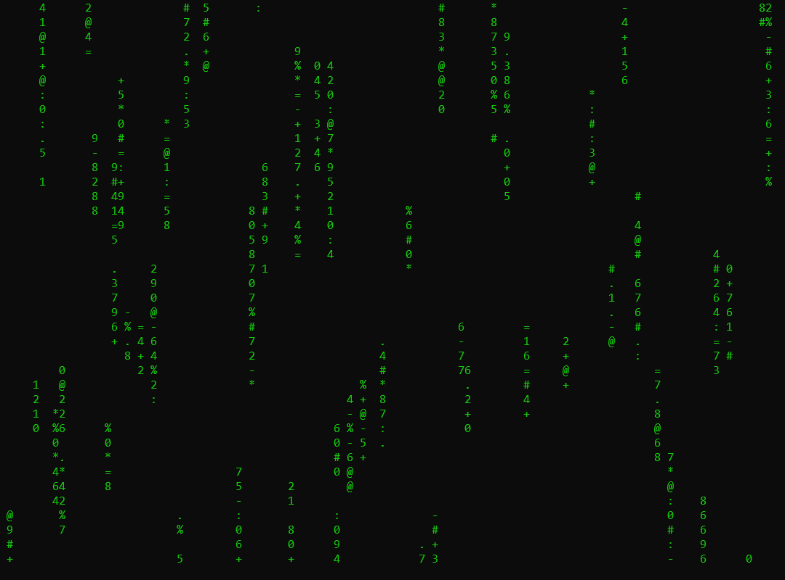
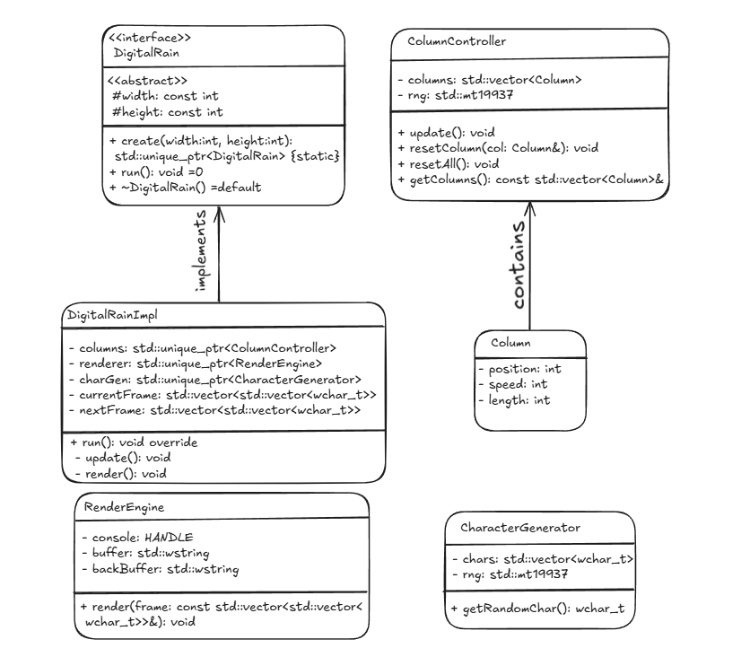

## Digital Rain Simulation in C++

## UML Diagram of Digital Rain Project

The diagram shows the main classes and their relationships

Private variables are marked with "-", public with "+", protected with "#"

Static methods are marked with {static}

The Column struct is shown as a separate class since it has its own behavior


### Introduction

This project is a C++ implementation of the "Digital Rain" effect inspired by the Matrix movies. It uses modern C++ techniques like object-oriented programming, smart pointers, and Windows API functions for console manipulation. My goal was to create a visually appealing implementation of the effect in a Windows console.

### Design & Test

The design consists of a few core components:
- **Character Generator**: A class that randomly selects characters to be displayed in the rain effect.
- **Column Controller**: Manages the individual columns of text, their speed, length, and reset behavior.
- **DigitalRain Class**: The main class that integrates all components and manages the rendering process.

I tested the simulation by running the program in different console sizes to ensure that characters moved smoothly in both window types.

### Algorithm
- **Initialize the console window with the required dimensions.**
- **Create and manage multiple columns of falling characters.**
- **Randomly determine character selection, movement speed, and length for each column.**
- **Update and redraw the console output to show falling characters.**
- **Makes sure columns reset properly once they exit the screen.**

**This algorithm create a smooth and non-repetitive animation.**

### Problem-solving

Some challenges that I had during development:
- **Character Encoding Issues**: The console needed to be set to UTF-8 mode to properly display Unicode characters which still didn't work for katana.
- **Randomization Optimization**: generating characters without noticeable repetition.
- **Performance Optimization**: Reducing flickering by changing screen refresh rates and character updates.
- **Column Movement Synchronization**: Columns had to move at different speeds.

### Modern C++ Insight & Reflection
This project was a great opportunity for me to try out C++ features, including:
- **Smart Pointers**: I used these to manage memory dynamically.
- **Random Number Generation**: Used the `<random>` library for realistic RNG.
- **Object-Oriented Design**: Made sure my components were reuasble and modular.

Through this project, I learned about console rendering techniques, working with Windows API, and structuring code for reusability and maintainability.

### How to Run the Code

- A **Windows** system with a command-line terminal.
- A C++ compiler (e.g., `g++` from MinGW or MSVC).

### Compilation & Execution
1. Download the repository.
2. Open your terminal and navigate to the project directory.
3. Compile the code:
- **g++ -o digital_rain DigitalRain.cpp Main.cpp -std=c++17 -Wall**
Run the compiled executable:
- **digital_rain.exe**
- **For Linux/macOS, you may need to replace windows.h with cross-platform alternatives.**


## Final Code 
### DigitalRain.h
```cpp
#ifndef DIGITALRAIN_H
#define DIGITALRAIN_H

#include <vector>
#include <memory>
#include <windows.h>

class DigitalRain {
public:
    static std::unique_ptr<DigitalRain> create(int width, int height);
    virtual void run() = 0;
    virtual ~DigitalRain() = default;

protected:
    DigitalRain(int width, int height) : width(width), height(height) {}
    const int width;
    const int height;
};

#endif
```


### DigitalRain.cpp
```cpp
#include "DigitalRain.h"
#include <iostream>
#include <random>
#include <chrono>
#include <thread>
#include <algorithm>
#include <io.h>
#include <fcntl.h>

class CharacterGenerator {
    const std::vector<wchar_t> chars = {
        L'0', L'1', L'2', L'3', L'4', L'5', L'6', L'7', L'8', L'9',
        L'#', L'@', L'%', L'=', L'+', L'*', L':', L'-', L'.', L' '
    };
    std::mt19937 rng;

public:
    CharacterGenerator() : rng(std::random_device{}()) {}
    wchar_t getRandomChar() {
        std::uniform_int_distribution<size_t> dist(0, chars.size() - 1);
        return chars[dist(rng)];
    }
};

class ColumnController {
    struct Column {
        int position;
        int speed;
        int length;
    };

    std::vector<Column> columns;
    std::mt19937 rng;

public:
    ColumnController(int count) : rng(std::random_device{}()) {
        columns.resize(count);
        resetAll();
    }

    void update() {
        for (auto& col : columns) {
            col.position += col.speed;
            if (col.position > 100) {
                resetColumn(col);
            }
        }
    }

    void resetColumn(Column& col) {
        std::uniform_int_distribution<int> posDist(-50, -10);
        std::uniform_int_distribution<int> speedDist(1, 3);
        std::uniform_int_distribution<int> lenDist(5, 15);

        col.position = posDist(rng);
        col.speed = speedDist(rng);
        col.length = lenDist(rng);
    }

    void resetAll() {
        for (auto& col : columns) resetColumn(col);
    }

    const std::vector<Column>& getColumns() const { return columns; }
};
```


### Main.cpp
```cpp
#include "DigitalRain.h"
#include <windows.h>

int main() {
    system("chcp 65001 > nul");
    system("mode con: cols=120 lines=40");

    CONSOLE_SCREEN_BUFFER_INFO csbi;
    GetConsoleScreenBufferInfo(GetStdHandle(STD_OUTPUT_HANDLE), &csbi);
    int width = csbi.srWindow.Right - csbi.srWindow.Left + 1;
    int height = csbi.srWindow.Bottom - csbi.srWindow.Top + 1;

    auto rain = DigitalRain::create(width, height);
    rain->run();

    return 0;
}
```

## Conclusion
- **This Digital Rain simulation demonstrates C++ features, random generation, and  console rendering. It provides a visually pleasing display of falling characters. Future enhancements could include interactive menus for controlling speed and column size, color variations, and graphical implementations using a GUI framework.**
